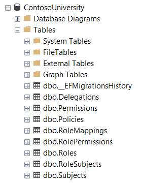

EntityFrameworkCore
===================

This article describes how to use Orca with EntityFrameworkCore store.

Setup
-----

First add the ``Orca.Store.EntityFrameworkCore`` package into your project.

.. code-block:: console
  :caption: .NET CLI

  dotnet add package Orca.Store.EntityFrameworkCore

.. code-block:: console
  :caption: Package Manager

  Install-Package Orca.Store.EntityFrameworkCore

In the *Program.cs*, register the EntityFrameworkCore store:

.. code-block:: csharp

  builder.Services
    .AddOrca()
    .AddEntityFrameworkStores<ContosoDbContext>();

  builder.Services.AddDbContext<ContosoDbContext>((sp, options) => {
    var configuration = sp.GetRequiredService<IConfiguration>();

    options.UseSqlServer(configuration.GetConnectionString("Default"), sqlServerOptions =>
    {
        sqlServerOptions.MigrationsAssembly(Assembly.GetExecutingAssembly().FullName);
    });
  });

``AddEntityFrameworkStores`` method configures Orca stores to use EntityFramework persistence.

The ``DbContext`` to be configured must inherit from ``OrcaDbContext``.

Migrations
----------

To create a migration named ``InitialCreate``:

.. code-block:: console
  :caption: .NET CLI

  dotnet ef migrations add InitialCreate

.. code-block:: console
  :caption: PowerShell

  Add-Migration InitialCreate

To apply the migration and create the database schema:

.. code-block:: console
  :caption: .NET CLI

  dotnet ef database update

.. code-block:: console
  :caption: PowerShell

  Update-Database

At this point the database should be created.

